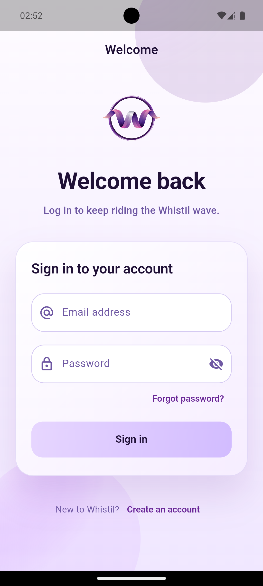
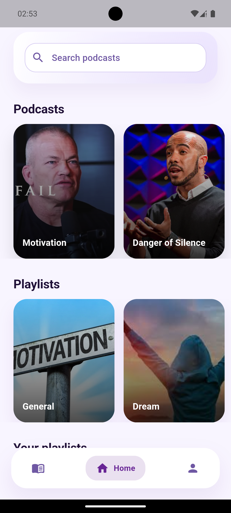
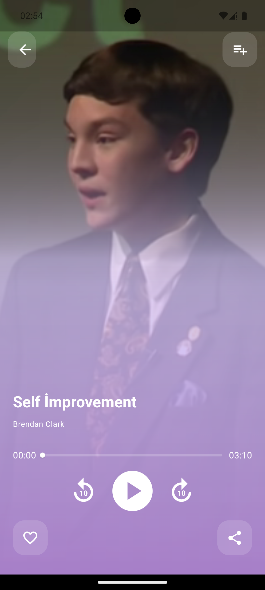
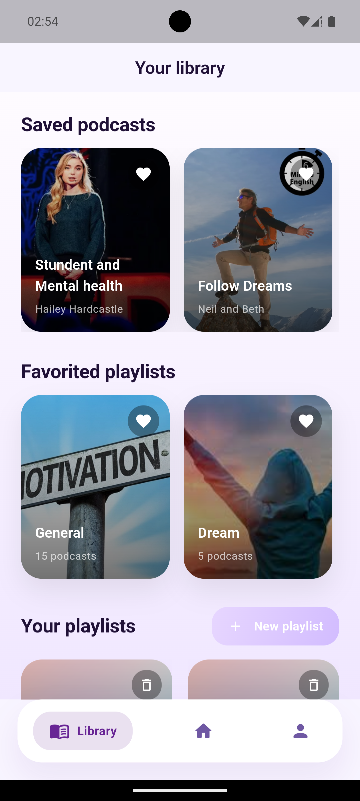
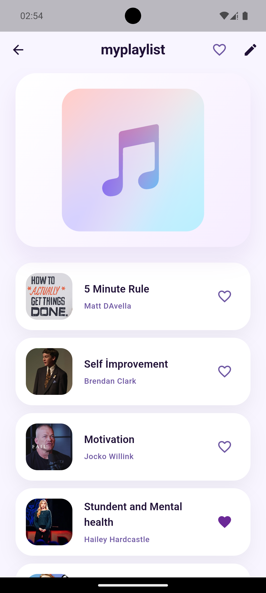
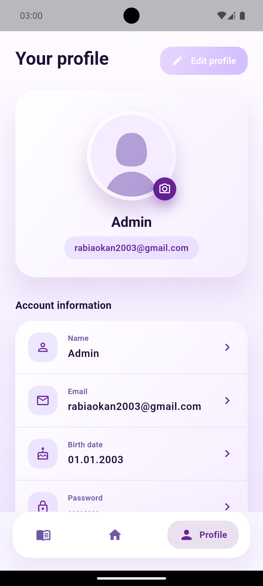

# Whistil Podcast Player

A modern, Firebase-backed Flutter application for discovering, bookmarking and listening to podcasts with a personalised Whistil-branded UI. Users can create accounts, manage their profile and avatar, build playlists, and stream episodes with rich controls.

## ✨ Highlights

- Email & password authentication with email verification
- Profile management with Firebase Storage powered avatar upload/removal
- Curated home feed, search experience and detailed episode play view
- Personal library featuring favourite podcasts, playlists and user-created collections
- Smooth audio playback using `just_audio` with custom player controls
- Whistil design system (gradients, typography, reusable widgets)

## 🧱 Tech Stack

| Area            | Choice / Package                     |
|-----------------|---------------------------------------|
| Framework       | Flutter 3 (Material 3)                |
| State / Routing | Flutter Navigator, custom helpers     |
| Backend         | Firebase Auth, Cloud Firestore        |
| Storage         | Firebase Storage (profile avatars)    |
| Media           | `just_audio`, `rxdart`, `share_plus`  |
| Device APIs     | `image_picker`, `shared_preferences`  |

## 📁 Project Structure

```
lib/
├── models/              # Plain data models (songs, playlists, profile results)
├── screens/             # UI screens (home, library, profile, auth, playback)
├── theme/               # Whistil palette & gradients
├── utils/               # Navigation helpers
├── widgets/             # Reusable components (buttons, nav, player widgets)
└── firebase_options.dart# Generated FlutterFire configuration
assets/
├── images/              # Illustrations, thumbnails, profile placeholder
└── music/               # Local audio samples for development/demo
```

## 🚀 Getting Started

### Prerequisites

- Flutter SDK `>= 3.3.0`
- Dart `>= 3.3.0`
- Firebase project with iOS/Android configuration files

### 1. Clone & install dependencies

```bash
git clone https://github.com/rabiabasak/podcastplayer.git
cd podcastplayer
flutter pub get
```

### 2. Configure Firebase

1. Copy the template and fill in your own Firebase credentials:
   ```bash
   cp lib/firebase_options.dart.example lib/firebase_options.dart
   ```
   Then replace every `YOUR_*` placeholder with the values from your Firebase project console — or simply run `flutterfire configure` to generate the file automatically.
2. Download your `google-services.json` (Android) and `GoogleService-Info.plist` (iOS) from the Firebase console and place them under:
   - `android/app/google-services.json`
   - `ios/Runner/GoogleService-Info.plist`

### 3. Run the app

```bash
flutter run
```

Use `flutter run -d chrome` for the web build (after enabling Firebase web targets) or `flutter run -d windows`/`macos`/`linux` for desktop once Firebase configs are added.

### 4. (Optional) Generate launcher icons

The project includes `flutter_launcher_icons`. Update the icon assets if needed and run:

```bash
flutter pub run flutter_launcher_icons
```

## 🖼️ Screenshots & Media

Explore Whistil's modern interface and core user flows.

| **Sign-in & Auth** | **Home Feed** | **Player** |
|:---:|:---:|:---:|
|  |  |  |

| **Library** | **Playlists** | **Profile** |
|:---:|:---:|:---:|
|  |  |  |

> Looking for marketing material? The launch poster lives at `docs/poster/whistil-poster.png`.

## ✅ Quality Checklist

- [ ] Copy `firebase_options.dart.example` → `firebase_options.dart` and fill in your credentials
- [ ] Provide production bundle IDs / package names in Firebase
- [ ] Replace demo audio or images if using licensed material
- [ ] Run `flutter analyze` & `flutter test` before pushing

## 👥 Contributors

This project was collaboratively developed by the following team:

| | İsim | GitHub |
|:-:|---|---|
| 👩‍💻 | **Rabia Başak** | [@rabiabasak](https://github.com/rabiabasak) |
| 👩‍💻 | **Okan Can Camcı** | [@Tilhium](https://github.com/Tilhium) |


